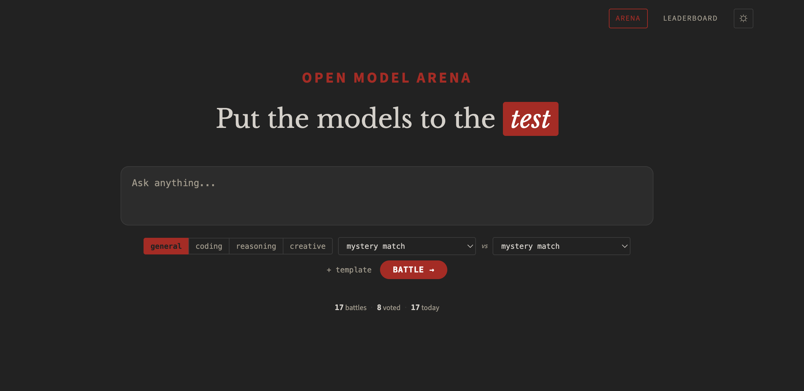

# Open Model Arena

> Compare local and cloud models in a self-hosted arena using blind voting and ELO rankings.

**Bring your own models. Run blind battles.**

If you're running your own AI stack -- Ollama on a Mac Mini, models on a GPU server, llama.cpp on bare metal, vLLM in a container -- you've probably wondered how your local models actually compare to the cloud APIs you're paying for. Open Model Arena gives you a way to find out.

Two models get the same prompt. You read both responses without knowing which model wrote which. You vote. ELO rankings track the results over time. That's it.

## Who is this for?

- **Homelab and self-hosted AI users** running Ollama, LM Studio, vLLM, or LocalAI who want to benchmark their models against cloud APIs
- **Teams evaluating models** for internal use who need blind comparisons on their own prompts, not public benchmarks
- **Anyone with an OpenAI-compatible endpoint** -- cloud providers, local inference, API gateways, proxies, or a mix of all of them

## How is this different?

Public leaderboards test their models with their prompts on their hardware. Those rankings don't tell you how Mistral 7B running on your Mac Mini compares to GPT-4o for the prompts your team actually uses.

Open Model Arena runs on your infrastructure. You bring whatever models you have -- a $0 local model running on a Raspberry Pi and a $15/million-token cloud API get the same blind evaluation. The results reflect your workloads, not a synthetic benchmark.

- **Any OpenAI-compatible endpoint**: OpenAI, Anthropic (via proxy), Google, Ollama, LM Studio, vLLM, LiteLLM, LocalAI, or your org's internal gateway
- **Runs anywhere**: a Mac Mini, a NAS, a Linux box, a VM, a cloud instance -- it's FastAPI + SQLite, not a distributed system
- **Your data stays yours** -- nothing leaves your network unless you're calling cloud APIs
- **YAML config** -- add or swap models without touching code

## Screenshots



## Features

- **Blind comparison** -- models are hidden until after you vote
- **Targeted comparison** -- pick two specific models to go head-to-head
- **Real-time streaming** -- both responses stream simultaneously via Server-Sent Events
- **ELO leaderboard** -- standard ELO rating system (K=32), filterable by category
- **Category support** -- general, coding, reasoning, creative
- **Cost tracking** -- per-response cost estimates based on model pricing config
- **Vote audit log** -- full history with before/after ELO for every vote
- **Markdown rendering** -- responses rendered with syntax highlighting
- **Prompt templates** -- save and reuse prompts from localStorage
- **Battle export** -- download battle history as CSV or JSON
- **Dark/light theme** -- toggle persists across sessions

## How It Works

1. Enter a prompt and select a category
2. Two models are randomly selected (configurable rules prevent unfair pairings)
3. Both models receive the prompt and stream responses side-by-side
4. Vote: **A Wins**, **Tie**, or **B Wins**
5. Models are revealed with latency, token count, cost, and ELO change
6. Leaderboard tracks cumulative performance

## Quick Start

```bash
# Clone and configure
git clone https://github.com/pete-builds/open-model-arena.git
cd open-model-arena
cp models.yaml.example models.yaml
cp .env.example .env

# Edit models.yaml with your API endpoints and keys
# Edit .env with a passphrase and a random token secret:
#   ARENA_PASSPHRASE=your-secret-phrase
#   AUTH_TOKEN_SECRET=$(openssl rand -hex 32)

# Start
docker compose up -d
```

Open `http://localhost:3694`

### HTTPS Note

Auth cookies are set with `Secure=True`, which requires HTTPS. This works automatically on `localhost` (browsers treat it as secure). For remote access, put the app behind any HTTPS-capable reverse proxy (nginx, Caddy, Cloudflare Tunnel, Tailscale Funnel, etc.).

## Configuration

### Environment Variables

| Variable | Required | Description |
|----------|----------|-------------|
| `ARENA_PASSPHRASE` | Yes | Passphrase users enter to access the arena |
| `AUTH_TOKEN_SECRET` | Yes | Secret key for signing auth tokens (`openssl rand -hex 32`) |
| `GATEWAY_API_KEY` | No | API key for your gateway provider (referenced in `models.yaml` via `api_key_env`) |
| `TZ` | No | Timezone for "battles today" stat (default: `America/New_York`) |

See `.env.example` for a ready-to-copy template. The app will refuse to start without `ARENA_PASSPHRASE` and `AUTH_TOKEN_SECRET`.

### models.yaml

The model registry is a YAML file that defines providers and models. See `models.yaml.example` for the full format.

```yaml
providers:
  my-gateway:
    base_url: "https://your-api-gateway.com/v1"
    api_key_env: "GATEWAY_API_KEY"  # reads from environment
    timeout: 30

  local-ollama:
    base_url: "http://localhost:11434/v1"
    api_key: "ollama"
    timeout: 120
    local: true                     # prevents pairing two local models

models:
  - id: gpt-4o
    provider: my-gateway
    display_name: "GPT-4o"
    model_id: "gpt-4o"
    input_cost_per_1m: 2.5
    output_cost_per_1m: 10.0
    categories: [general, coding, reasoning, creative]
    enabled: true
```

**Key points:**
- `api_key_env` reads the key from an environment variable (recommended)
- `api_key` sets the key directly (for local services like Ollama)
- `model_id` is what gets sent in the API request
- `categories` controls which battles a model can appear in
- Set `enabled: false` to temporarily remove a model

### Model Selection Rules

- Models are randomly paired from the selected category
- The system avoids pairing two local (Ollama) models together
- Position (A vs B) is randomized to prevent position bias

## Tech Stack

- **Backend:** Python / FastAPI
- **AI Client:** OpenAI SDK (works with any OpenAI-compatible API)
- **Streaming:** Server-Sent Events (SSE)
- **Database:** SQLite with WAL mode
- **Frontend:** Vanilla JS + ES modules (no build step)
- **Container:** Docker

## API

| Method | Path | Description |
|--------|------|-------------|
| `POST` | `/api/battle` | `{"prompt": "...", "category": "general"}` |
| `GET` | `/api/battle/{id}/stream` | SSE stream with model events |
| `POST` | `/api/battle/{id}/vote` | `{"winner": "a\|b\|tie"}` |
| `GET` | `/api/leaderboard?category=overall` | ELO rankings |
| `GET` | `/api/stats` | Battle counts |
| `GET` | `/api/models` | List enabled models |
| `GET` | `/api/export?format=csv` | Download battle history |
| `GET` | `/healthz` | Health check |

## ELO System

- Starting rating: 1500
- K-factor: 32
- Ratings tracked per-category and overall
- Ties award 0.5 score to each model
- Provisional threshold: minimum 5 battles before ranked

## Prior Art

Inspired by [Chatbot Arena](https://lmarena.ai/) (LMSYS), which pioneered blind model comparison at scale. Open Model Arena brings that concept to self-hosted infrastructure for teams and individuals who want to evaluate models privately.

## License

MIT
